# chock-cursor-plugins

[](https://github.com/open-coder-ai/chock-cursor-plugins/actions/workflows/generated-only.yml)
[](LICENSE)
[](https://github.com/open-coder-ai/chock-catalog)

Chock policies packaged as installable plugins for **Cursor**. Guard policies ship a real
`beforeShellExecution` hook, so a matched destructive command is **denied in the editor
before it runs** — witnessed blocking on a real Cursor install (2026-08-24), with benign
commands in the same session still allowed.



**This repository is generated.** Every file is compiled from policy sources in
[chock-catalog](https://github.com/open-coder-ai/chock-catalog) by
[chock](https://github.com/open-coder-ai/chock). Pull requests here are closed with a
pointer to the catalog — review belongs where the source is.

## Install

Cursor reads this repository as a plugin marketplace via `.cursor-plugin/marketplace.json`:

```
# Team marketplace: Dashboard -> Plugins -> Add Marketplace -> Import from Repo
#   https://github.com/open-coder-ai/chock-cursor-plugins
# Local install of one plugin (developer flow):
#   copy cursor/<plugin-id>/ to ~/.cursor/plugins/local/<plugin-id>/ and reload Cursor
```

## What a plugin actually does — read this before installing

- **Guard policies** ship the hook, a guard script and a stdlib-only adapter, and are
  **session-enforced**: the hook returns Cursor's `permission: "deny"` response and the
  command is refused. This needs `python3` and a usable `bash` on PATH; without them
  Cursor allows the command silently — the hook **fails OPEN**, and every guard's
  description says so verbatim. On Windows, disable the `python3` Microsoft Store alias
  or install Python.
- **Advisory policies** are a skill the client reads; nothing stops a violation.

See **[PLUGINS.md](PLUGINS.md)** for every policy, its version and its posture — generated
from the packages themselves, so it cannot drift from what is published.

**A plugin is not the same as adopting Chock.** A plugin governs one person's session in
one editor. Repo-wide enforcement — git hooks and a CI gate a session cannot skip — comes
from installing Chock in the repository:

```bash
pip install chock
chock init && chock sync --ci
```

## Layout

```
cursor/<policy-id>/                Cursor plugin packages (.cursor-plugin/plugin.json;
                                   hooks/hooks.json where the policy has a guard)
.cursor-plugin/marketplace.json    the index Cursor reads
```

## Trust

- **Generated only:** CI regenerates from the pinned catalog and fails on any difference.
- **Byte-identical guards:** guard scripts and the hook adapter are verbatim copies of
  their framework sources — a plugin cannot quietly behave differently from a repo install.
- **Best-effort, not a boundary:** guards are pattern-based filters. See
  [SECURITY.md](https://github.com/open-coder-ai/chock/blob/main/SECURITY.md).

## Contributing

Pull requests that change packages here are closed automatically, and not because the
change is unwelcome: every package is compiled from the catalog, so an edit here would be
overwritten at the next publish and would carry none of a policy's checks. What is welcome,
and where it goes:

| You want to | Go to |
| :--- | :--- |
| Fix or add a policy | [chock-catalog](https://github.com/open-coder-ai/chock-catalog/blob/main/CONTRIBUTING.md) — it reaches every client from there, including this one |
| Report that a guard did or did not block on your Cursor version | an issue on [chock](https://github.com/open-coder-ai/chock/issues/new/choose), which records the witnessed-blocking claims these packages carry; "it fails open where you say it fails closed" is the most useful result you can send |
| Report a bug in how packages are generated | [chock](https://github.com/open-coder-ai/chock/issues/new/choose), where the emitter lives |
| Fix this README | here — it is the one hand-written file in the repository |

## Part of the open-coder-ai family

Everything under [open-coder-ai](https://github.com/open-coder-ai) is built on one rule: a claim must match a
mechanism. Where this repository sits among the others:

| Repository | What it is |
| :--- | :--- |
| [chock](https://github.com/open-coder-ai/chock) | The framework: write a policy once, enforce it on git hooks, CI, and every agent |
| [chock-catalog](https://github.com/open-coder-ai/chock-catalog) | The policies, each graded by what it actually enforces |
| [agentseam](https://github.com/open-coder-ai/agentseam) | The primitives layer under chock: one handler API over every agent's hooks, with a capability matrix that carries its provenance |
| [context-report](https://github.com/open-coder-ai/context-report) | A signed report format for whether a plugin, hook, skill or `AGENTS.md` actually works |
| [chock-threat-intel](https://github.com/open-coder-ai/chock-threat-intel) | A weekly, human-reviewed threat digest scored against the catalog |
| [chock-claude-plugins](https://github.com/open-coder-ai/chock-claude-plugins) · [copilot](https://github.com/open-coder-ai/chock-copilot-plugins) · [codex](https://github.com/open-coder-ai/chock-codex-plugins) | The same catalog compiled for the other clients; generated only, like this one |
| [chock-quickstart](https://github.com/open-coder-ai/chock-quickstart) · [chock-example](https://github.com/open-coder-ai/chock-example) | Template repositories: exactly what `chock init` leaves behind, and a working adoption with one policy per layer |

## License

Apache-2.0, same as the framework and the catalog.
